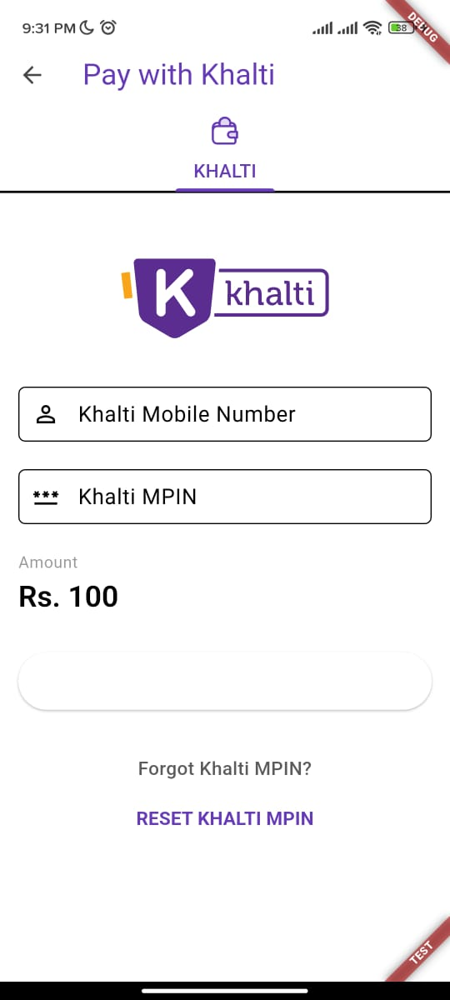

# 🚀 Khalti Flutter Integration Example

This is a sample Flutter project demonstrating how to integrate [Khalti](https://khalti.com/) digital wallet into a Flutter application for seamless payment processing.

---

## 🛠️ How to Use

1. **Login to your Khalti account**  
   If you don’t have one, you can create an account at [Khalti Signup](https://khalti.com/app/#/auth/signup/).
   
2. **Initiate a payment**  
   After a successful login, Khalti will send an MPIN to your device. Enter the MPIN to complete the authentication.

3. **Enjoy payment integration**  
   You’re now ready to process payments using the Khalti test environment.

---

## ⚙️ Setup Instructions

### ✅ Android Configuration

#### 1. Specify NDK version

In your `android/app/build.gradle.kts`, make sure to add:

```kotlin
ndkVersion = "27.0.12077973"
```

> **Note:** This is necessary for compatibility with Khalti SDK dependencies.

#### 2. Add Internet Permission

In your `AndroidManifest.xml`, add the following permission **above** the `<application>` tag:

```xml
<uses-permission android:name="android.permission.INTERNET" />
```

#### 3. Deep Linking Configuration

Add the following block inside the `<activity>` tag in `android/app/src/main/AndroidManifest.xml`, just **above** the `</activity>` tag:

```xml
<meta-data android:name="flutter_deeplinking_enabled" android:value="true" />
<intent-filter android:autoVerify="true">
    <action android:name="android.intent.action.VIEW" />
    <category android:name="android.intent.category.DEFAULT" />
    <category android:name="android.intent.category.BROWSABLE" />
    <data android:scheme="kpg" android:host="khalti_example" />
</intent-filter>
```

---

### 🍏 iOS Configuration

In your `ios/Runner/Info.plist`, add the following keys:

```xml
<key>NSAppTransportSecurity</key>
<dict>
    <key>NSAllowsArbitraryLoads</key>
    <true/>
</dict>

<key>FlutterDeepLinkingEnabled</key>
<true/>

<key>CFBundleURLTypes</key>
<array>
    <dict>
        <key>CFBundleTypeRole</key>
        <string>Editor</string>
        <key>CFBundleURLSchemes</key>
        <array>
            <string>kpg</string>
        </array>
        <key>CFBundleURLName</key>
        <string>$(FLUTTER_BUILD_NAME)</string>
    </dict>
</array>
```

---

## 🔑 Test & Production Keys

- This project uses **`test_key`** provided by Khalti for sandbox testing.
- For production, replace it with your **live key** from the [Khalti Merchant Dashboard](https://khalti.com/merchant/).

---

## 📦 Dependencies

Ensure the following plugin is added to your `pubspec.yaml`:

```yaml
dependencies:
  khalti_flutter: ^3.0.0 # Replace with the latest version
```

Run:

```bash
flutter pub get
```

---

## 📸 Screenshots




---

## ❗ Additional Notes

- Deep linking and URL schemes must match the ones set in the Khalti dashboard.
- Always test in a real device before going live.
- Ensure your Khalti merchant account is approved and verified before using live keys.

---

## 🧑‍💻 Author

**Sangam Giri**  
Samarth Technical Research and Innovations Pvt. Ltd.  
[https://satritech.com](https://satritech.com)

---